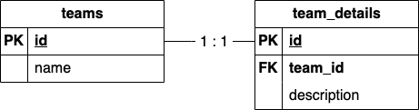
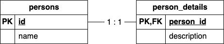
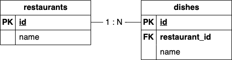
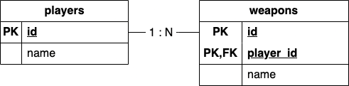
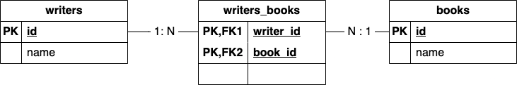
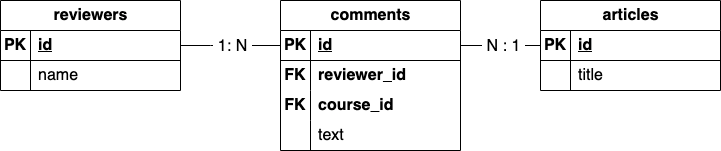
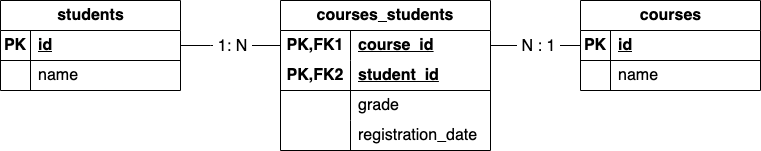

# spring-data-jpa-relationships

The goal of this project is to study the JPA relationships: `one-to-one`, `one-to-many` / `many-to-one`, and `many-to-many`.

## Tutorials

> **I Would Appreciate Your Support**: I’m embarking on a writing journey on [Medium](https://medium.com/@ivangfr) and I would be grateful for your support. If you enjoy my content, please consider [following me](https://medium.com/@ivangfr). **I am committed to following you back**, and together we can share our knowledge and experiences on the platform.

- \[**Medium**\] [**Understanding Relationships in JPA: Introduction**](https://medium.com/@ivangfr/understanding-relationships-in-jpa-introduction-5416c8a7c8a9)
- \[**Medium**\] [**Understanding Relationships in JPA: One-to-One with Simple Primary Key**](https://medium.com/@ivangfr/understanding-relationships-in-jpa-one-to-one-with-simple-primary-key-7c32f7e13a6a)
- \[**Medium**\] [**Understanding Relationships in JPA: One-to-One with Shared Primary Key**](https://medium.com/@ivangfr/understanding-relationships-in-jpa-one-to-one-with-shared-primary-key-36596416fe56)
- \[**Medium**\] [**Understanding Relationships in JPA: One-to-Many with Simple Primary Key**](https://medium.com/@ivangfr/understanding-relationships-in-jpa-one-to-many-with-simple-primary-key-e2e975c67c31)
- \[**Medium**\] [**Understanding Relationships in JPA: One-to-Many with Composite Primary Key**](https://medium.com/@ivangfr/understanding-relationships-in-jpa-one-to-many-with-composite-primary-key-1d7724a2bf63)

## Prerequisites

- [`Java 17+`](https://www.oracle.com/java/technologies/downloads/#java17)
- [`Docker`](https://www.docker.com/)
- [`Docker-Compose`](https://docs.docker.com/compose/install/)

## Start Environment

In a terminal and inside `spring-data-jpa-relationships` root folder, run the following command
```
docker-compose up -d
```

## Running application using Maven

In a terminal and inside `spring-data-jpa-relationships` root folder, run the command below
```
./mvnw clean spring-boot:run
```

Once the application is running, you can access its Swagger website at http://localhost:8080/swagger-ui.html

## Running Tests

In a terminal and inside `spring-data-jpa-relationships` root folder, run the following command
```
./mvnw clean test
```

## JPA relationships

### One-to-One with Simple Primary Key



\[**Medium**\]: [**Understanding Relationships in JPA: One-to-One with Simple Primary Key**](https://medium.com/@ivangfr/understanding-relationships-in-jpa-one-to-one-with-simple-primary-key-7c32f7e13a6a)

### One-to-One with Shared Primary Key



\[**Medium**\] [**Understanding Relationships in JPA: One-to-One with Shared Primary Key**](https://medium.com/@ivangfr/understanding-relationships-in-jpa-one-to-one-with-shared-primary-key-36596416fe56)

### One-to-Many with Simple Primary Key



\[**Medium**\] [**Understanding Relationships in JPA: One-to-Many with Simple Primary Key**](https://medium.com/@ivangfr/understanding-relationships-in-jpa-one-to-many-with-simple-primary-key-e2e975c67c31)

### One-to-Many with Composite Primary Key



\[**Medium**\] [**Understanding Relationships in JPA: One-to-Many with Composite Primary Key**](https://medium.com/@ivangfr/understanding-relationships-in-jpa-one-to-many-with-composite-primary-key-1d7724a2bf63)

### Many-to-Many with Simple Primary Key



Medium article

### Many-to-Many with Simple Primary Key and Extra Column



Medium article

### Many-to-Many with Composite Primary Key and Extra Column



Medium article

## Useful Commands

- **Postgres**
  ```
  docker exec -it postgres psql -U postgres -d jparelationshipsdb
  \d persons
  select * from persons;
  ```
  > Type `exit` to exit

## References

One-to-One 
- https://vladmihalcea.com/the-best-way-to-map-a-onetoone-relationship-with-jpa-and-hibernate
- https://www.callicoder.com/hibernate-spring-boot-jpa-one-to-one-mapping-example/

One-to-Many / Many-to-One
- https://vladmihalcea.com/the-best-way-to-map-a-onetomany-association-with-jpa-and-hibernate
- https://www.callicoder.com/hibernate-spring-boot-jpa-one-to-many-mapping-example/

Many-to-Many
- https://vladmihalcea.com/the-best-way-to-use-the-manytomany-annotation-with-jpa-and-hibernate
- https://www.callicoder.com/hibernate-spring-boot-jpa-many-to-many-mapping-example/