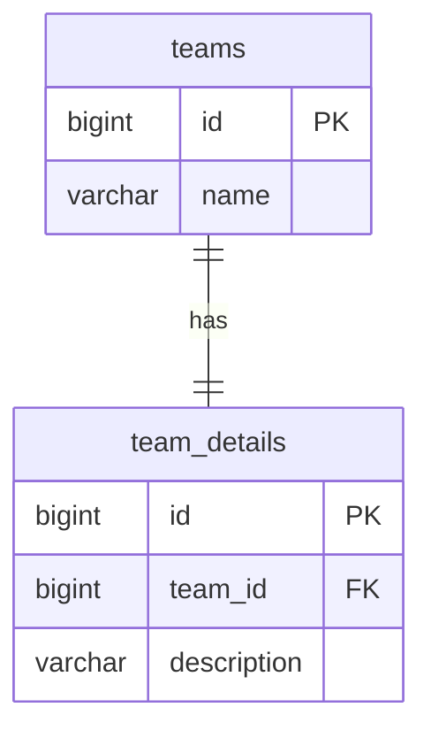
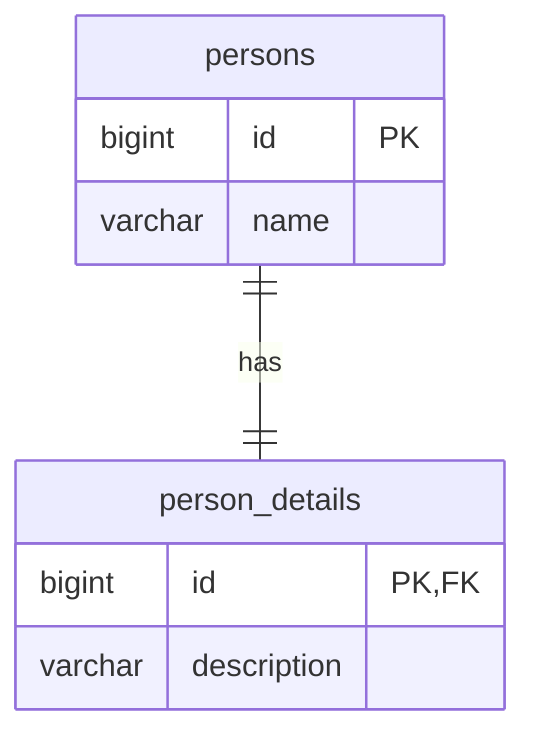
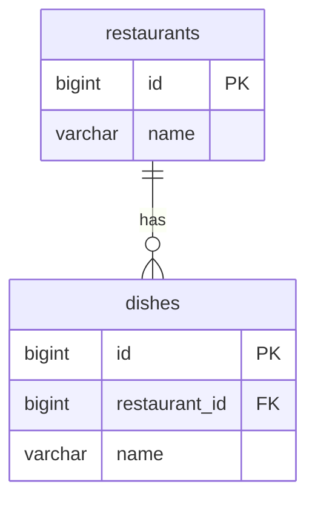
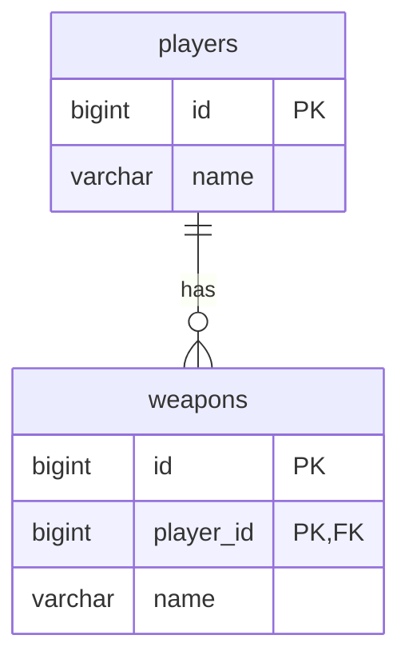
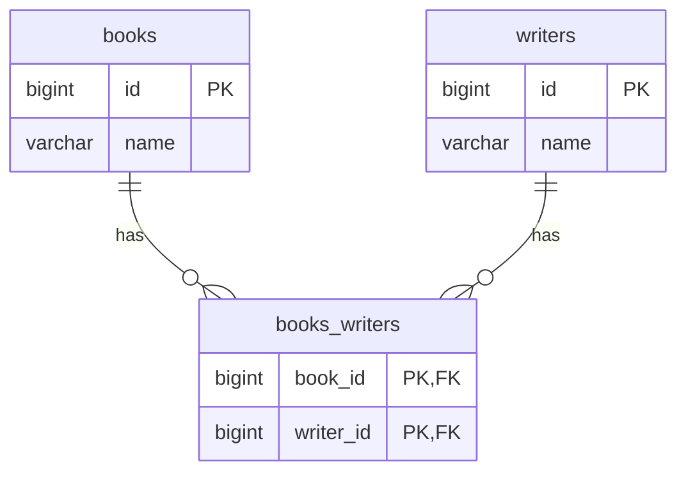
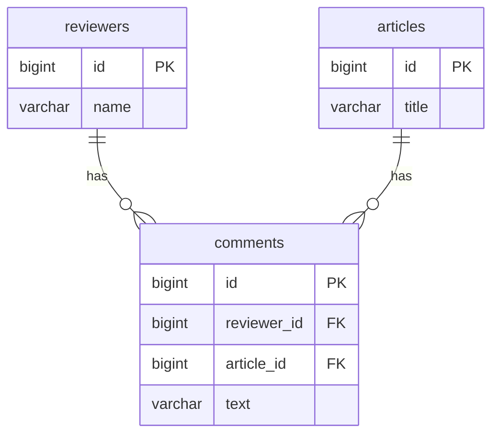
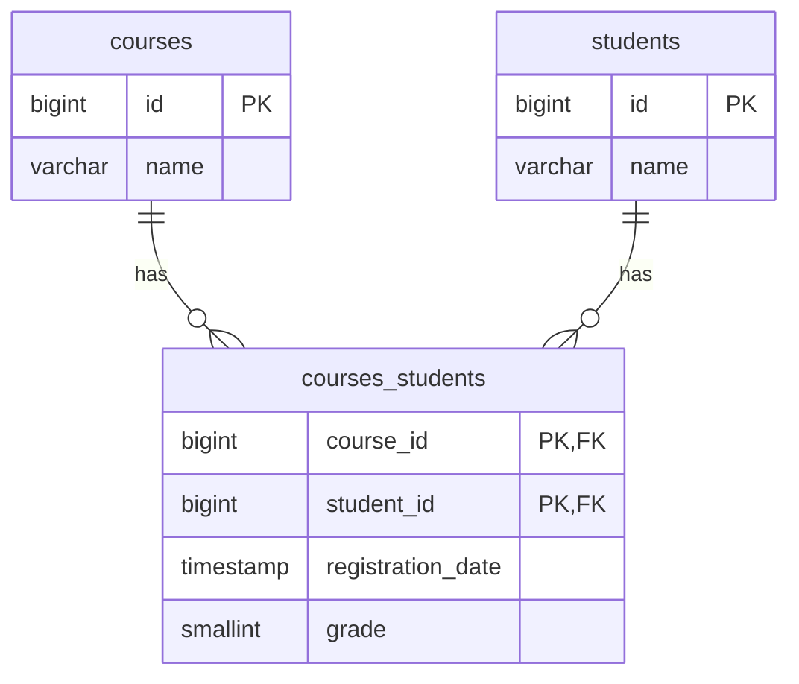

# spring-data-jpa-relationships

[](LICENSE)
[](https://buymeacoffee.com/ivan.franchin)

The goal of this project is to study the JPA relationships: `one-to-one`, `one-to-many` / `many-to-one`, and `many-to-many`.

## Proof-of-Concepts & Articles

On [ivangfr.github.io](https://ivangfr.github.io), I have compiled my Proof-of-Concepts (PoCs) and articles. You can easily search for the technology you are interested in by using the filter. Who knows, perhaps I have already implemented a PoC or written an article about what you are looking for.

## Additional Readings

- \[**Medium**\] [**The 7 JPA Relationship Patterns Every Spring Boot Developer Should Know**](https://medium.com/@ivangfr/the-7-jpa-relationship-patterns-every-spring-boot-developer-should-know-f8ca70507644)
- \[**Medium**\] [**Understanding Relationships in JPA: Introduction**](https://medium.com/@ivangfr/understanding-relationships-in-jpa-introduction-5416c8a7c8a9)
- \[**Medium**\] [**Understanding Relationships in JPA: One-to-One with Simple Primary Key**](https://medium.com/@ivangfr/understanding-relationships-in-jpa-one-to-one-with-simple-primary-key-7c32f7e13a6a)
- \[**Medium**\] [**Understanding Relationships in JPA: One-to-One with Shared Primary Key**](https://medium.com/@ivangfr/understanding-relationships-in-jpa-one-to-one-with-shared-primary-key-36596416fe56)
- \[**Medium**\] [**Understanding Relationships in JPA: One-to-Many with Simple Primary Key**](https://medium.com/@ivangfr/understanding-relationships-in-jpa-one-to-many-with-simple-primary-key-e2e975c67c31)
- \[**Medium**\] [**Understanding Relationships in JPA: One-to-Many with Composite Primary Key**](https://medium.com/@ivangfr/understanding-relationships-in-jpa-one-to-many-with-composite-primary-key-1d7724a2bf63)
- \[**Medium**\] [**Understanding Relationships in JPA: Many-to-Many with Simple Primary Key**](https://medium.com/@ivangfr/understanding-relationships-in-jpa-many-to-many-with-simple-primary-key-b38209e5c9b4)
- \[**Medium**\] [**Understanding Relationships in JPA: Many-to-Many with Simple Primary Key and Extra Column**](https://medium.com/@ivangfr/understanding-relationships-in-jpa-many-to-many-with-simple-primary-key-and-extra-column-817e8bdda465)
- \[**Medium**\] [**Understanding Relationships in JPA: Many-to-Many with Composite Primary Key and Extra Column**](https://medium.com/@ivangfr/understanding-relationships-in-jpa-many-to-many-with-composite-primary-key-and-extra-column-a939b107c7cd)
- \[**Medium**\] [**Mastering JPA Relationships: Practical Examples of Bidirectional Associations**](https://medium.com/@ivangfr/spring-data-jpa-6bb5cd745b46)

## Prerequisites

- [`Java 25`](https://www.oracle.com/java/technologies/downloads/#java25) or higher;
- A containerization tool (e.g., [`Docker`](https://www.docker.com), [`Podman`](https://podman.io), etc.)

## Start Environment

In a terminal and inside the `spring-data-jpa-relationships` root folder, run the following command:
```bash
docker compose up -d
```

## Running application using Maven

In a terminal and inside the `spring-data-jpa-relationships` root folder, run the command below:
```bash
./mvnw clean spring-boot:run
```

Once the application is running, you can access its Swagger website at http://localhost:8080/swagger-ui.html.

## Useful Commands

- **Postgres**
  ```bash
  docker exec -it postgres psql -U postgres -d jparelationshipsdb
  \d persons
  select * from persons;
  ```
  > Type `exit` to exit

## Shutdown

- To stop the application, go to the terminal where it is running and press `Ctrl+C`;
- To stop and remove docker compose containers, networks and volumes, go to a terminal and, inside the `spring-data-jpa-relationships` root folder, run the following command:
  ```bash
  docker compose down -v
  ```

## Running Tests

In a terminal and inside the `spring-data-jpa-relationships` root folder, run the following command:
```bash
./mvnw clean test
```

## JPA relationships

### One-to-One with Simple Primary Key


```mermaid
erDiagram
    teams {
        bigint id PK
        varchar name
    }
    team_details {
        bigint id PK
        bigint team_id FK
        varchar description
    }
    teams ||--|| team_details : "has"
```

\[**Medium**\]: [**Understanding Relationships in JPA: One-to-One with Simple Primary Key**](https://medium.com/@ivangfr/understanding-relationships-in-jpa-one-to-one-with-simple-primary-key-7c32f7e13a6a)

### One-to-One with Shared Primary Key


```mermaid
erDiagram
    persons {
        bigint id PK
        varchar name
    }
    person_details {
        bigint id PK, FK
        varchar description
    }
    persons ||--|| person_details : "has"
```

\[**Medium**\] [**Understanding Relationships in JPA: One-to-One with Shared Primary Key**](https://medium.com/@ivangfr/understanding-relationships-in-jpa-one-to-one-with-shared-primary-key-36596416fe56)

### One-to-Many with Simple Primary Key


```mermaid
erDiagram
    restaurants {
        bigint id PK
        varchar name
    }
    dishes {
        bigint id PK
        bigint restaurant_id FK
        varchar name
    }
    restaurants ||--o{ dishes : "has"
```

\[**Medium**\] [**Understanding Relationships in JPA: One-to-Many with Simple Primary Key**](https://medium.com/@ivangfr/understanding-relationships-in-jpa-one-to-many-with-simple-primary-key-e2e975c67c31)

### One-to-Many with Composite Primary Key


```mermaid
erDiagram
    players {
        bigint id PK
        varchar name
    }
    weapons {
        bigint id PK
        bigint player_id PK, FK
        varchar name
    }
    players ||--o{ weapons : "has"
```

\[**Medium**\] [**Understanding Relationships in JPA: One-to-Many with Composite Primary Key**](https://medium.com/@ivangfr/understanding-relationships-in-jpa-one-to-many-with-composite-primary-key-1d7724a2bf63)

### Many-to-Many with Simple Primary Key


```mermaid
erDiagram
    writers {
        bigint id PK
        varchar name
    }
    books {
        bigint id PK
        varchar name
    }
    books_writers {
        bigint book_id PK, FK
        bigint writer_id PK, FK
    }
    books ||--o{ books_writers : "has"
    writers ||--o{ books_writers : "has"
```

\[**Medium**\] [**Understanding Relationships in JPA: Many-to-Many with Simple Primary Key**](https://medium.com/@ivangfr/understanding-relationships-in-jpa-many-to-many-with-simple-primary-key-b38209e5c9b4)

### Many-to-Many with Simple Primary Key and Extra Column


```mermaid
erDiagram
    reviewers {
        bigint id PK
        varchar name
    }
    articles {
        bigint id PK
        varchar title
    }
    comments {
        bigint id PK
        bigint reviewer_id FK
        bigint article_id FK
        varchar text
    }
    reviewers ||--o{ comments : "has"
    articles ||--o{ comments : "has"
```

\[**Medium**\] [**Understanding Relationships in JPA: Many-to-Many with Simple Primary Key and Extra Column**](https://medium.com/@ivangfr/understanding-relationships-in-jpa-many-to-many-with-simple-primary-key-and-extra-column-817e8bdda465)

### Many-to-Many with Composite Primary Key and Extra Column


```mermaid
erDiagram
    courses {
        bigint id PK
        varchar name
    }
    students {
        bigint id PK
        varchar name
    }
    courses_students {
        bigint course_id PK, FK
        bigint student_id PK, FK
        timestamp registration_date
        smallint grade
    }
    courses ||--o{ courses_students : "has"
    students ||--o{ courses_students : "has"
```

\[**Medium**\] [**Understanding Relationships in JPA: Many-to-Many with Composite Primary Key and Extra Column**](https://medium.com/@ivangfr/understanding-relationships-in-jpa-many-to-many-with-composite-primary-key-and-extra-column-a939b107c7cd)

## Code Formatting

This project enforces consistent Java formatting using the [Spotless](https://github.com/diffplug/spotless/tree/main/plugin-maven) Maven plugin with [google-java-format](https://github.com/google/google-java-format) (GOOGLE style).

- **Check formatting**:
  ```bash
  ./mvnw spotless:check
  ```

- **Auto-fix formatting**:
  ```bash
  ./mvnw spotless:apply
  ```

Formatting is enforced automatically during `./mvnw verify`.

## Support

If you find this useful, consider buying me a coffee:

<a href="https://buymeacoffee.com/ivan.franchin"></a>

## License

This project is licensed under the [MIT License](./LICENSE).

## References

One-to-One 
- https://vladmihalcea.com/the-best-way-to-map-a-onetoone-relationship-with-jpa-and-hibernate
- https://www.callicoder.com/hibernate-spring-boot-jpa-one-to-one-mapping-example/

One-to-Many / Many-to-One
- https://vladmihalcea.com/the-best-way-to-map-a-onetomany-association-with-jpa-and-hibernate
- https://www.callicoder.com/hibernate-spring-boot-jpa-one-to-many-mapping-example/

Many-to-Many
- https://vladmihalcea.com/the-best-way-to-use-the-manytomany-annotation-with-jpa-and-hibernate
- https://www.callicoder.com/hibernate-spring-boot-jpa-many-to-many-mapping-example/